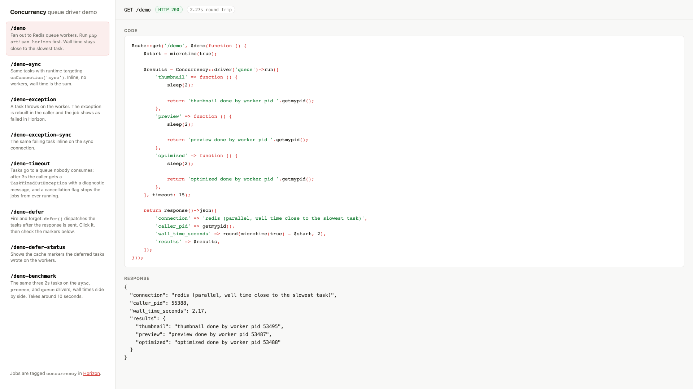
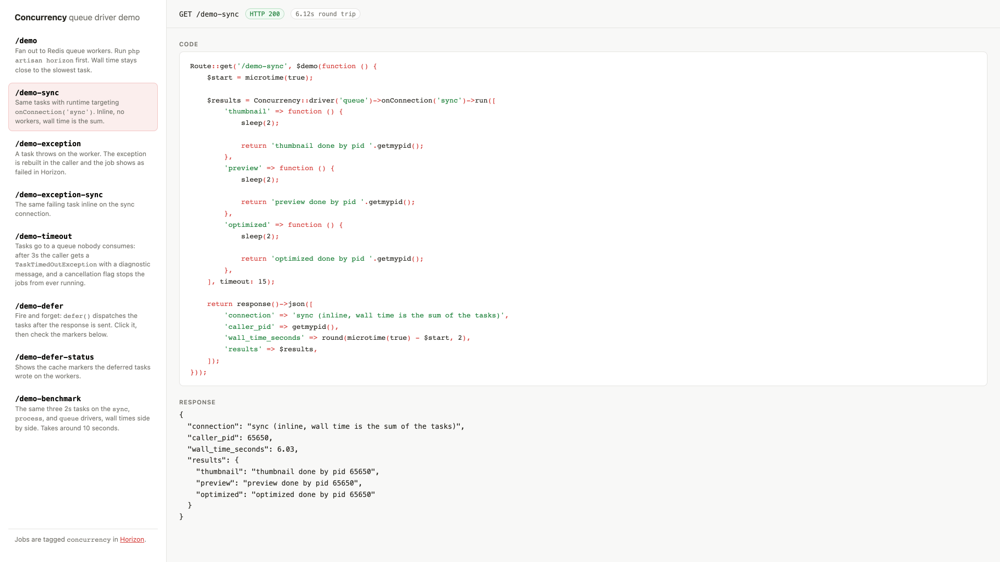
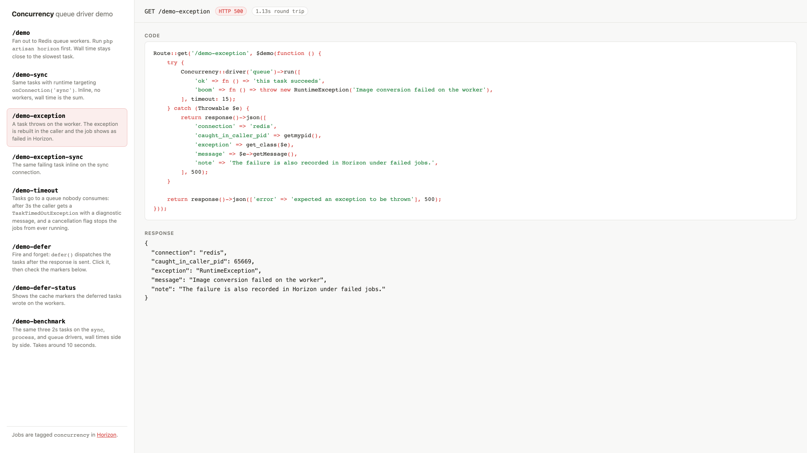
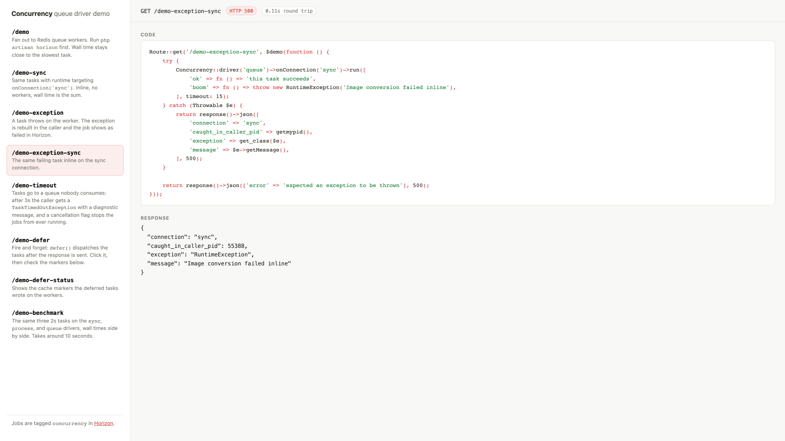
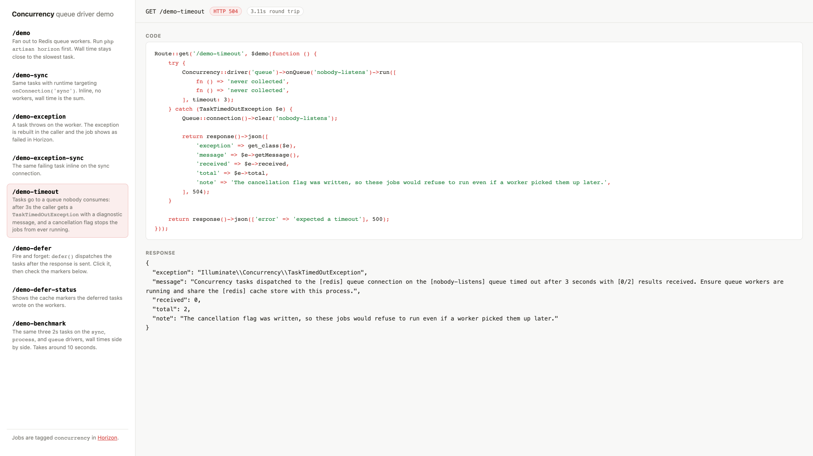
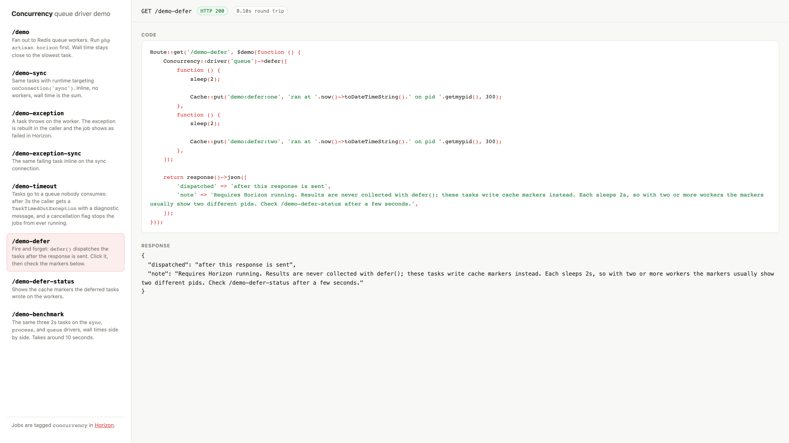
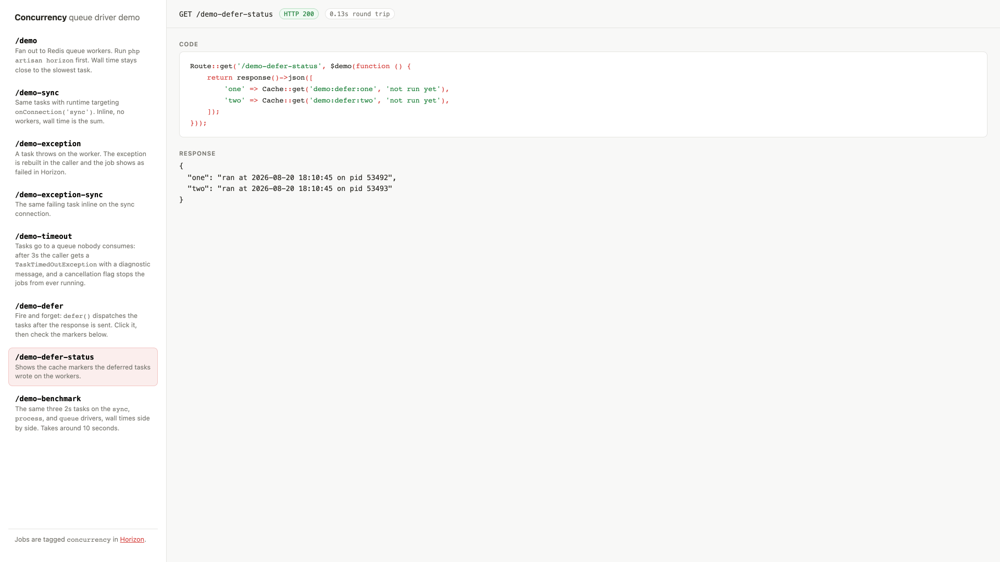
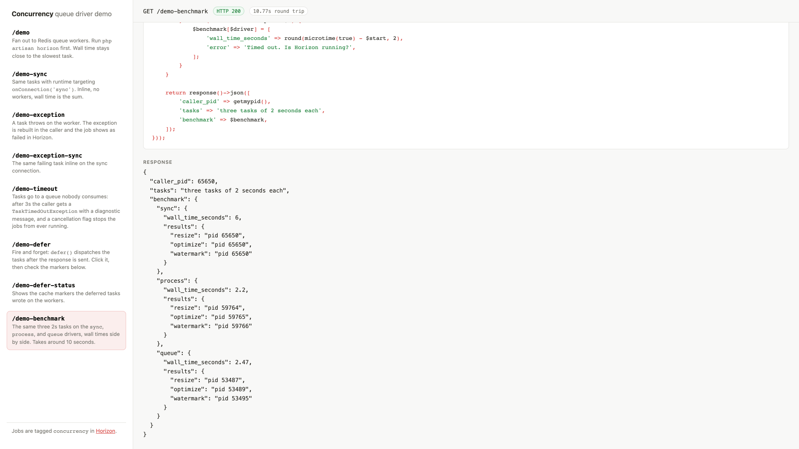

# Laravel queue concurrency driver demo

A small app to try the proposed `queue` driver for Laravel's Concurrency component:
the same blocking `Concurrency::run()` API, but the closures run on your queue workers
and the results come back to the caller.

```php
$results = Concurrency::driver('queue')->run([
    'thumbnail' => fn () => ProcessImage::thumbnail($path),
    'preview' => fn () => ProcessImage::preview($path),
    'optimized' => fn () => ProcessImage::optimize($path),
]);
```

The driver lives on the `queue-concurrency-driver` branch of my framework fork
(see the [PR](https://github.com/mathiasgrimm/framework/pull/2)), and Composer
installs it straight from there, so the app works out of the box. If you want to
edit the driver itself while running the demos, there is a symlink setup at the
end of [Local setup](#local-setup).

## Deploying to Laravel Cloud

This is the setup where the queue driver shines:
[managed queues](https://laravel.com/cloud/docs/queues#managed-queues) scale to zero,
wake in under a second when jobs arrive, and bill per second, so `Concurrency::run()`
gets on demand parallel compute from a small web instance.

The [Cloud CLI](https://cloud.laravel.com/docs/cli) runs through
[cpx](https://cpx.dev), so there is nothing to install globally (no cpx yet?
`composer global require cpx/cpx`). Authenticate first:

```sh
cpx laravel/cloud-cli auth
```

Create the application and its environment, then the managed queue and a cache. The
queue is named `concurrency` so it matches `CONCURRENCY_QUEUE`, and the cache is what
transports the task results back to the caller:

```sh
cpx laravel/cloud-cli ship
cpx laravel/cloud-cli managed-queue:create production --name=concurrency --max-workers=20
cpx laravel/cloud-cli cache:create
cpx laravel/cloud-cli environment:variables
```

Set `CACHE_STORE=redis` and `CONCURRENCY_QUEUE=concurrency` when the variables prompt
opens, then deploy again so everything is picked up:

```sh
cpx laravel/cloud-cli deploy
```

The managed queue sets `QUEUE_CONNECTION=cloud` for the environment on deploy, so the
driver dispatches to it without further configuration. Two notes: Horizon does not
support managed queues, so on Cloud you skip `horizon:listen` and the workers, metrics,
and failed jobs live in the environment's Queues dashboard instead. And jobs on the
Flex compute class should finish within 90 seconds, which fits the demo tasks and the
driver's 60 second default timeout comfortably.

## Local setup

You need PHP 8.3+, Composer, and a local Redis (Laravel Herd ships one; `brew install
redis` works too):

```sh
git clone git@github.com:mathiasgrimm/concurrency-demo.git
cd concurrency-demo

composer install
cp .env.example .env
php artisan key:generate
touch database/database.sqlite
php artisan migrate
npm install
```

The `npm install` brings in [Chokidar](https://github.com/paulmillr/chokidar), which
`horizon:listen` uses to watch for file changes (see
[the Horizon docs](https://laravel.com/docs/horizon#automatically-restarting-horizon)).

The queue and the cache both use Redis, so the queue and the result store are shared
between processes. `CONCURRENCY_QUEUE=concurrency` points the driver at a dedicated
`concurrency` queue, which Horizon consumes with a pool of warm workers
(`supervisor-concurrency` in `config/horizon.php`, `minProcesses => 10`). Warm workers
matter for the demos: Horizon's default supervisor autoscales from one process, and a
short burst of tasks is over before it reacts, so the tasks would run sequentially on
a single worker. A dedicated queue is also the recommended production setup, so
`run()` never competes with your regular jobs.

### Editing the driver itself

Composer installs the framework from the fork on GitHub. If you want to edit the
driver and see your changes live, clone the fork next to this app and switch to it:

```sh
git clone -b queue-concurrency-driver git@github.com:mathiasgrimm/framework.git ../laravel-framework-13.x
composer update laravel/framework
```

The path repository in `composer.json` wins whenever that sibling folder exists, so
`vendor/laravel/framework` becomes a symlink to the checkout and your edits are live
immediately. This changes `composer.lock` locally; keep that change out of your
commits.

## Try it

Terminal 1:

```sh
php artisan horizon:listen
```

`horizon:listen` restarts the workers whenever the code changes, and this demo's
`config/horizon.php` also watches the framework's Concurrency component, so with the
symlink setup from [Local setup](#editing-the-driver-itself) your driver edits
restart the workers automatically. Plain `php artisan horizon` works too if you
prefer to restart manually (inside Docker or Vagrant, use
`php artisan horizon:listen --poll`).

Terminal 2 (skip it if you use Herd, the app is served on your `.test` domain):

```sh
php artisan serve
```

Then open the app in the browser. The welcome page has a sidebar with every demo:
click one and the right panel shows the exact route code that runs (sliced from
`routes/web.php` via reflection, so it never drifts) and the JSON response, with
round trip timing.

There is also a console version:

```sh
php artisan demo:concurrency
```

## The demos

Every demo shows the route code that runs and the JSON response side by side.
Jobs are tagged `concurrency` and `concurrency:{runId}` in Horizon, and a failing
task appears under failed jobs as a `CapturedTaskException` wrapping the original.

### /demo

Three "image" tasks fan out to the workers and the results come back in the same
request. With warm workers the wall time stays close to the slowest task (2s), not
the sum, and the results show different worker pids.



### /demo-sync

The same tasks with `->onConnection('sync')` (runtime targeting). Runs inline, no
workers needed, wall time is the sum (6s). Good contrast run.



### /demo-exception

A task throws on the worker; the exception is rebuilt and rethrown in the caller,
and also shows up in Horizon under failed jobs.



### /demo-exception-sync

The same failing task inline on the sync connection.



### /demo-timeout

Tasks are sent to a queue no worker consumes, so after 3 seconds the caller receives
a `TaskTimedOutException` with a diagnostic message naming the connection, queue,
and cache store. The cancellation flag means the jobs would refuse to run even if a
worker picked them up later.



### /demo-defer and /demo-defer-status

The fire and forget half of the contract. `defer()` dispatches the tasks after the
response is sent; the tasks write cache markers you can inspect on the status
endpoint. Each task sleeps 2s, so with two or more workers the markers usually show
different pids; with one worker the timestamps land 2s apart instead. There is no
pid affinity, the tasks are independent jobs.





### /demo-benchmark

The same three 2 second tasks on the `sync`, `process`, and `queue` drivers, wall
times side by side. One JSON response showing the same blocking contract with three
execution models.



## Things worth trying

- Stop Horizon and run `php artisan demo:concurrency --timeout=5`: you get a
  `TaskTimedOutException` after 5 seconds, and the queued jobs will refuse to run
  once a worker comes back (cancellation flag).
- Runtime targeting: `Concurrency::driver('queue')->onQueue('images')->run([...])`
  then start a worker with `php artisan queue:work --queue=images`.
- Tinker: `php artisan tinker` then
  `Concurrency::driver('queue')->run([fn () => getmypid(), fn () => getmypid()])`.
